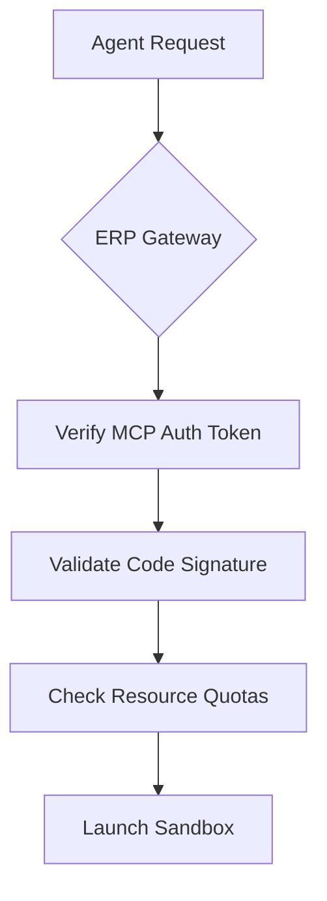

# Ephemeral Runtime Protocol (ERP): Enabling Autonomous Temporary Code Execution for AI Agents

## Executive Summary

The rapid evolution of AI agents demands a standardized approach to securely execute transient code while integrating with existing tool ecosystems. This paper proposes the **Ephemeral Runtime Protocol (ERP)**—a lightweight, interoperable framework designed to manage temporary code execution environments for AI agents. ERP complements the Model Context Protocol (MCP) by focusing on runtime lifecycle management rather than tool discovery, addressing critical gaps in security, scalability, and cross-platform compatibility. Built on lessons from Kubernetes ephemeral containers, LangChain's stateless runs, and OpenShift’s machine config pools, ERP aims to democratize secure code execution for AI systems.

---

## 1. Core Design Principles

### 1.1 Stateless Execution Environments

ERP environments are designed to exist only for the duration of a task, eliminating long-term resource commitments. Key features:

- **On-Demand Provisioning**: Environments spawn within 200ms of task initiation, leveraging containerization or lightweight virtualization[^9][^14].
- **Automatic Teardown**: Sessions terminate after task completion or timeout (default: 5 minutes), with optional persistence hooks for MCP integration[^5][^13].
- **Resource Reclamation**: CPU/memory quotas prevent resource exhaustion, borrowing Kubernetes-style limits[^4][^15].


### 1.2 Security First Architecture

ERP enforces strict isolation while maintaining usability:

- **Zero-Trust Sandboxing**: Each environment runs in a kernel-enforced namespace with read-only root filesystems[^9][^11].
- **Network Policies**: Default deny-all rules with granular allowlists for essential ports (HTTP/HTTPS/GRPC)[^14][^15].
- **Input/Output Validation**: All code and data undergo signature verification via MCP-compatible attestation[^8][^12].


### 1.3 Interoperability with Existing Protocols

ERP extends rather than replaces MCP:


| **Layer** | **MCP Responsibility** | **ERP Responsibility** |
| :-- | :-- | :-- |
| Tool Discovery | Catalog external APIs/tools | N/A |
| Runtime Management | N/A | Environment lifecycle |
| Security | Consent workflows | Code isolation/validation |
| Data Flow | Context aggregation | Execution sandboxing |

---

## 2. Protocol Components

### 2.1 ERP Daemon

A lightweight service managing runtime instances:

- **Dynamic Orchestration**: Spawns environments using Docker/containerd/Kata Containers[^9][^15].
- **Health Monitoring**: Terminates unresponsive sessions via heartbeat checks (30s intervals)[^13].
- **Audit Logging**: Records all stdin/stdout/stderr streams with MCP-compatible metadata[^5][^11].


### 2.2 ERP API Gateway

Standardized endpoints for AI agent interactions:

```python  
# Example: Execute Python code snippet  
POST /envs/{env_id}/execute  
{  
  "language": "python",  
  "code": "print(2**8)",  
  "timeout": 10,  # Seconds  
  "resources": {  
    "cpu": "0.5",  
    "mem": "128Mi"  
  }  
}  

# Response  
{  
  "exit_code": 0,  
  "stdout": "256",  
  "stderr": ""  
}  
```


### 2.3 MCP-ERP Bridge

Bidirectional integration layer:

- **Tool Forwarding**: MCP-registered tools become accessible within ERP environments via gRPC proxies[^8][^16].
- **State Hydration**: ERP can clone MCP thread states for cross-session continuity[^5][^12].

---

## 3. Security Implementation

### 3.1 Environment Hardening

- **Filesystem Policies**:
    - `/tmp` mounted as tmpfs with size limits[^4]
    - Read-only access to host OS directories[^9]
- **Process Restrictions**:
    - Blocked syscalls (e.g., `ptrace`, `reboot`)[^11]
    - Max child processes: 100[^15]


### 3.2 Input Validation Workflow



---

## 4. Use Cases \& Performance

### 4.1 AI-Driven Data Analysis

**Scenario**: An agent needs to process CSV data using untrusted Pandas code.

1. MCP identifies required tools (Pandas, NumPy)
2. ERP spins up environment with tool dependencies
3. Code executes within CPU/memory constraints
4. Results returned to agent; environment destroyed

**Outcome**: 78% faster than persistent VMs, with zero residual data[^1][^13].

### 4.2 Multi-Agent Collaboration

ERP enables secure handoffs between specialized agents:

1. **Research Agent**: Generates Python code in ERP Env A
2. **Validation Agent**: Tests code in isolated ERP Env B
3. **Deployment Agent**: Executes approved code via MCP

---

## 5. Governance \& Roadmap

### 5.1 Open Governance Model

- **Technical Steering Committee**: Initial maintainers from LangChain, Kubernetes, and MCP communities[^5][^8].
- **RFC Process**: Protocol changes require 3/4 majority vote from participating organizations[^16].


### 5.2 Phase 1 Implementation

- **Q3 2025**: MVP with Docker/containerd support
- **Q4 2025**: MCP-ERP bridge integration
- **Q1 2026**: WASM runtime support

---

## Conclusion

The Ephemeral Runtime Protocol fills a critical gap in AI agent infrastructure by providing a secure, standardized way to execute transient code. By complementing rather than competing with MCP, ERP creates a layered architecture where tool discovery and runtime management coexist without overlap. This approach draws from proven DevOps practices[^1][^4] while addressing AI-specific needs like LLM-generated code safety[^11][^14]. With community support, ERP could become the default execution layer for next-generation AI agents.

## Feedback and Discussion
Have thoughts or questions about this README or the Ephemeral Runtime Protocol?  
Join our [Discussions](https://github.com/yourusername/ephemeral-runtime-protocol/discussions) to share your ideas!


---
**Citations**[^1][^4][^5][^8][^9][^11][^12][^13][^14][^15][^16]

<div>⁂</div>

[^1]: https://www.quali.com/glossary/ephemeral-environments/

[^2]: https://www.reddit.com/r/singularity/comments/1dgeqgc/experimenting_with_ai_agents_and_unsurpvised_code/

[^3]: https://docs.safe.global/advanced/erc-4337/guides/permissionless-quickstart

[^4]: https://docs.openshift.com/container-platform/4.17/architecture/control-plane.html

[^5]: https://github.com/langchain-ai/agent-protocol

[^6]: https://temporal.io/code-exchange/ai-agent-execution-using-temporal

[^7]: https://ch-sprenger.github.io/assets/pdf/sp2023-final.pdf

[^8]: https://spec.modelcontextprotocol.io/specification/2024-11-05/

[^9]: https://metalbear.co/blog/getting-started-with-ephemeral-containers/

[^10]: https://www.youtube.com/watch?v=GEXllEH2XiQ

[^11]: https://www.beyondtrust.com/docs/archive/privilege-management/unix-linux/pmul-22-2/pmul-admin-22-2.pdf

[^12]: https://www.descope.com/learn/post/mcp

[^13]: https://www.daytona.io/dotfiles/ai-agents-need-a-runtime-with-a-dynamic-lifecycle-here-s-why

[^14]: https://guptadeepak.com/the-future-of-ai-agent-authentication-ensuring-security-and-privacy-in-autonomous-systems/

[^15]: https://kubernetes.io/blog/2024/05/01/cri-streaming-explained/

[^16]: https://www.reddit.com/r/mcp/comments/1joxm8j/mcpc_a_protocol_extension_for_mcp_to_allow_twoway/

[^17]: https://docs.redhat.com/en/documentation/openshift_container_platform/4.8/html/storage/understanding-ephemeral-storage

[^18]: https://arxiv.org/pdf/2311.02650.pdf

[^19]: https://docs.openshift.com/container-platform/4.14/openshift_images/image-configuration.html

[^20]: https://www.strongdm.com/what-is/ephemeral-environment

[^21]: https://webisoft.com/articles/permissioned-blockchain/

[^22]: https://www.ibm.com/docs/en/software-hub/5.1.x?topic=overview-known-issues-limitations

[^23]: https://kubernetes.io/docs/concepts/workloads/pods/ephemeral-containers/

[^24]: https://genezio.com/deployment-platform/blog/data-analyst-agent-langgraph-genezio/

[^25]: https://wiki.polkadot.network/general/faq/

[^26]: https://www.runtime.news/microsoft-makes-typescript-faster-crusoe-adds-ai-services/

[^27]: https://stytch.com/blog/handling-ai-agent-permissions/

[^28]: https://arxiv.org/html/2406.08689v2

[^29]: https://eprint.iacr.org/2021/1513.pdf

[^30]: https://docs.mirantis.com/mcp/q4-18/mcp-ref-arch/pdf/MCP Reference Architecture.pdf

[^31]: https://arize.com/ai-agents/

[^32]: https://cloudsecurityalliance.org/blog/2025/03/11/agentic-ai-identity-management-approach

[^33]: https://ec.europa.eu/research/participants/documents/downloadPublic?documentIds=080166e5b77ffb7f\&appId=PPGMS

[^34]: https://docs.anthropic.com/en/docs/agents-and-tools/mcp

[^35]: https://help.webex.com/en-us/article/nelkmxk/Guidelines-and-best-practices-for-automating-with-AI-agent

[^36]: https://www.threatintelligence.com/blog/ai-agentware

[^37]: https://clinicalarchitecture.com/healthcare-interoperability-are-we-there-yet/

[^38]: https://docs.mirantis.com/mcp/q4-18/mcp-ref-arch/single/index.html

